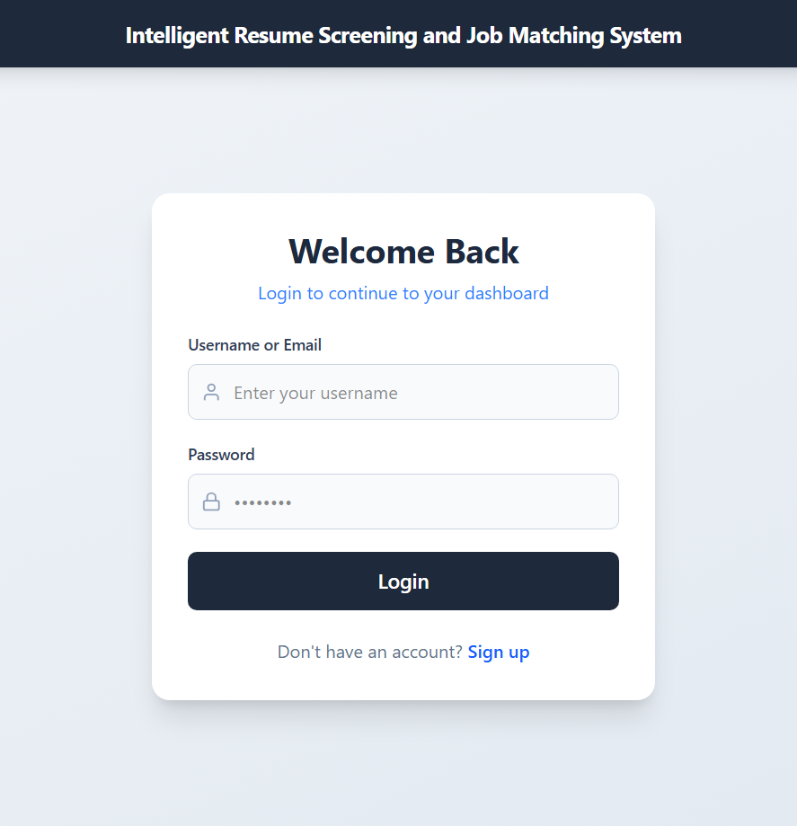
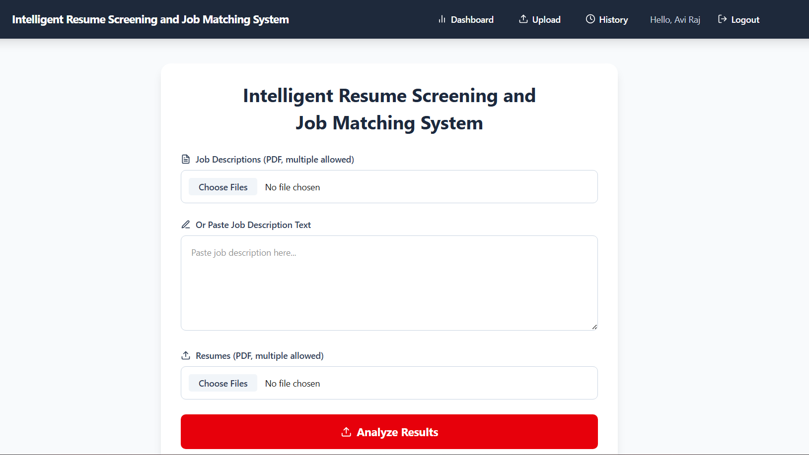
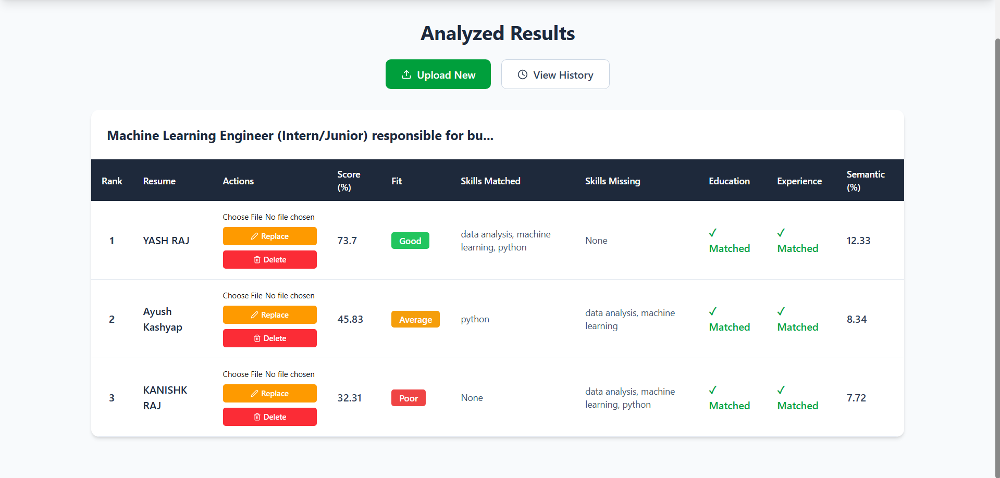
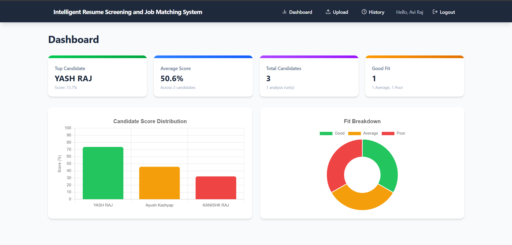

<div align="center">

# 🤖 AI Resume Screening & Job Matching System

### Intelligent ATS-Powered Resume Analysis with NLP

[](https://ai-resume-client-t3yv.onrender.com)
[](LICENSE)
[](https://nodejs.org)
[](https://react.dev)
[](https://fastapi.tiangolo.com)
[](https://mongodb.com)

<br/>

> **A production-ready, full-stack AI application** that analyzes resumes against job descriptions using NLP, TF-IDF similarity scoring, and intelligent skill matching — helping recruiters shortlist the best candidates in seconds.

<br/>

</div>

---

## 📸 Screenshots

<!-- 
  📌 HOW TO ADD SCREENSHOTS:
  1. Take screenshots of each page
  2. Create a folder: screenshots/ in your repo root  
  3. Add images there and update the paths below
  4. Or upload to imgur and paste the links
-->

| Login Page | Upload & Analyze |
|:---:|:---:|
|  |  |

| Results (Ranked Candidates) | Dashboard & Analytics |
|:---:|:---:|
|  |  |

---

## ✨ Key Features

| Feature | Description |
|---------|-------------|
| 🔍 **Smart Resume Parsing** | Extracts text, skills, education, and experience from PDF resumes automatically |
| 📊 **ATS Scoring Engine** | Weighted scoring: 40% skills + 30% semantic match + 20% experience + 10% education |
| 🧠 **NLP Similarity Analysis** | TF-IDF with word & character n-grams for intelligent resume-JD matching |
| 📈 **Interactive Dashboard** | Real-time charts (Bar + Doughnut) showing score distribution and fit breakdown |
| 👥 **Multi-Resume Upload** | Batch-upload and analyze multiple resumes against a single job description |
| 🔄 **Resume Replace & Re-analyze** | Replace a candidate's resume and get instant re-scoring without re-uploading all |
| 📜 **Analysis History** | Access all past screening sessions with full candidate details |
| 🔐 **JWT Authentication** | Secure login/register with protected routes and token-based auth |
| 📱 **Fully Responsive** | Works flawlessly on desktop, tablet, and mobile screens |

---

## 🏗️ System Architecture

```
┌──────────────────┐     ┌──────────────────┐     ┌──────────────────┐
│                  │     │                  │     │                  │
│   React Client   │────▶│  Express Server  │────▶│  FastAPI ML      │
│   (Vite + TW)    │     │  (Node.js API)   │     │  (Python NLP)    │
│                  │     │                  │     │                  │
│  • Upload UI     │     │  • Auth (JWT)    │     │  • PDF Parsing   │
│  • Dashboard     │     │  • File Proxy    │     │  • Skill Extract │
│  • Results View  │     │  • MongoDB CRUD  │     │  • TF-IDF Score  │
│  • History       │     │  • CORS Handler  │     │  • ATS Scoring   │
│                  │     │                  │     │                  │
└──────────────────┘     └────────┬─────────┘     └──────────────────┘
                                  │
                         ┌────────▼─────────┐
                         │   MongoDB Atlas   │
                         │   (Cloud DB)      │
                         └──────────────────┘
```

---

## 🛠️ Tech Stack

### Frontend
| Technology | Purpose |
|-----------|---------|
| React 19 | UI framework with hooks & context |
| Vite 8 | Lightning-fast dev server & bundler |
| Tailwind CSS 4 | Utility-first responsive styling |
| Chart.js | Interactive Bar & Doughnut charts |
| React Router v7 | Client-side routing with protected routes |
| Axios | HTTP client with interceptors |

### Backend
| Technology | Purpose |
|-----------|---------|
| Node.js + Express | REST API server |
| MongoDB + Mongoose | NoSQL database & ODM |
| JWT (jsonwebtoken) | Stateless authentication |
| Multer | Multipart file upload handling |
| Bcrypt.js | Password hashing |

### ML Service
| Technology | Purpose |
|-----------|---------|
| Python + FastAPI | High-performance ML API |
| scikit-learn | TF-IDF vectorization & cosine similarity |
| pdfplumber | PDF text extraction |
| NumPy + Pandas | Data processing |

### DevOps
| Technology | Purpose |
|-----------|---------|
| Render | Cloud hosting (3 services) |
| MongoDB Atlas | Managed cloud database |
| GitHub | Version control & CI/CD trigger |

---

## 📊 How ATS Scoring Works

```
Final ATS Score = (Skill Match × 40%) + (Semantic Similarity × 30%)
                + (Experience Match × 20%) + (Education Match × 10%)

Score ≥ 70  →  ✅ Good Fit
Score 40-69 →  ⚠️ Average Fit  
Score < 40  →  ❌ Poor Fit
```

**Semantic Similarity** uses a dual-approach:
- **Word n-grams (1,2)** — captures phrase-level matching (70% weight)
- **Character n-grams (3-5)** — catches partial matches & typos (30% weight)

---

## 🚀 Quick Start (Local Development)

### Prerequisites
- Node.js ≥ 18
- Python ≥ 3.10
- MongoDB Atlas account (or local MongoDB)

### 1. Clone the repo
```bash
git clone https://github.com/YashRaj363/AI-Resume-Screening-Job-Matching.git
cd AI-Resume-Screening-Job-Matching
```

### 2. Start ML Service
```bash
cd ml-service
python -m venv venv
venv\Scripts\activate        # Windows
# source venv/bin/activate   # Mac/Linux
pip install -r requirements.txt
python main.py               # Starts on :8000
```

### 3. Start Backend Server
```bash
cd server
npm install
# Create .env from .env.example and fill in your values
cp .env.example .env
npm start                    # Starts on :5000
```

### 4. Start Frontend Client
```bash
cd client
npm install
npm run dev                  # Starts on :5173
```

### 5. Open the app
Navigate to `http://localhost:5173` and start screening resumes! 🎉

---

## 🌐 Environment Variables

<details>
<summary><b>Server (.env)</b></summary>

| Variable | Description |
|----------|-------------|
| `PORT` | Server port (default: 5000) |
| `MONGO_URI` | MongoDB connection string |
| `JWT_SECRET` | Secret key for JWT signing |
| `ML_SERVICE_URL` | URL of the ML service |
| `CORS_ORIGIN` | Allowed frontend origin(s) |
| `MAX_FILE_SIZE_MB` | Max upload size (default: 10) |

</details>

<details>
<summary><b>Client (.env)</b></summary>

| Variable | Description |
|----------|-------------|  
| `VITE_API_URL` | Backend API URL (e.g. `http://localhost:5000/api`) |

</details>

---

## 📁 Project Structure

```
AI-Resume-Screening-Job-Matching/
├── client/                 # React Frontend
│   ├── src/
│   │   ├── components/     # Reusable UI components
│   │   ├── context/        # Auth & Results context providers
│   │   ├── pages/          # Route pages (Login, Upload, Results, Dashboard, History)
│   │   └── services/       # API service layer
│   └── package.json
├── server/                 # Node.js Backend
│   ├── config/             # Database configuration
│   ├── controllers/        # Route handlers
│   ├── middleware/          # Auth & error handling
│   ├── models/             # Mongoose schemas
│   ├── routes/             # Express routes
│   └── server.js           # Entry point
├── ml-service/             # Python ML Microservice
│   ├── main.py             # FastAPI app & /analyze endpoint
│   ├── scorer.py           # TF-IDF scoring & ATS computation
│   ├── skill_extractor.py  # NLP-based skill extraction
│   ├── resume_parser.py    # PDF parsing & name extraction
│   ├── utils.py            # Experience & education matching
│   └── requirements.txt
└── render.yaml             # Render deployment blueprint
```

---

## 🤝 Contributing

Contributions are welcome! Feel free to open issues or submit PRs.

1. Fork the repository
2. Create your feature branch (`git checkout -b feature/amazing-feature`)
3. Commit your changes (`git commit -m 'feat: add amazing feature'`)
4. Push to the branch (`git push origin feature/amazing-feature`)
5. Open a Pull Request

---

## 📄 License

This project is licensed under the MIT License — see the [LICENSE](LICENSE) file for details.

---

<div align="center">

### Made with ❤️ by [Yash Raj](https://github.com/YashRaj363)

⭐ **Star this repo if you found it useful!** ⭐

</div>
